### Anime-Plan

## 后端技术栈：

- web框架Echo

- 数据库ent
- 用户鉴权jwt
- 项目分层fx

项目的主要结构如下图所示，项目的layout采用的是Go 生态系统中一组常见的老项目和新项目的布局模式

https://github.com/golang-standards/project-layout

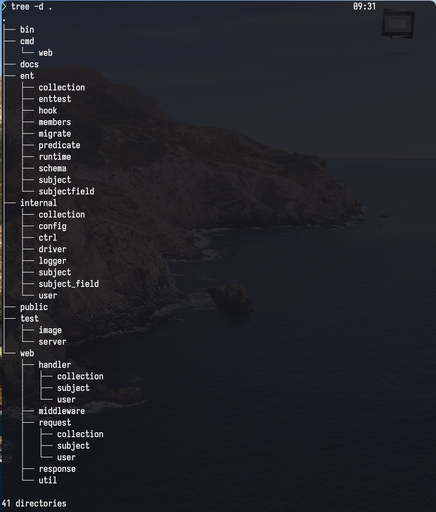

对于项目的配置我们采用的yaml文件

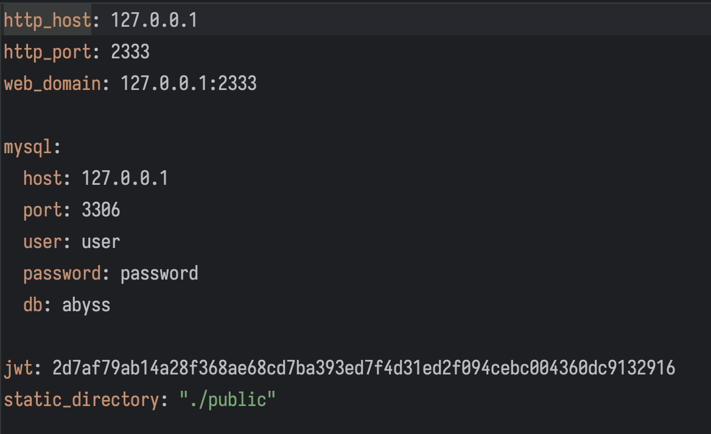

web框架使用的是Echo，它以小巧高性能著称，只提供了一些基本的功能。

我们还使用了uber开发的依赖注入库fx，避免了全局变量的使用。我们在每一个模块中有使用fx进行分层，层层推进，这样项目的结构会更加清晰。一下是一个例子。

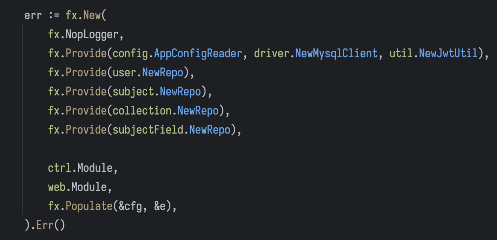

它还提供了生命周期的功能。fx可以管理应用程序的启动和关闭过程，保证所有的组件按照正确的顺序进行初始化和清理。

数据库采用的是ent框架，我们确定好数据库的表的schema后，就可以使用ent来生成，可以很方便的curd。其中的很方便的是ent里有一个edge的概念，表示两个或多个表之间的联系。

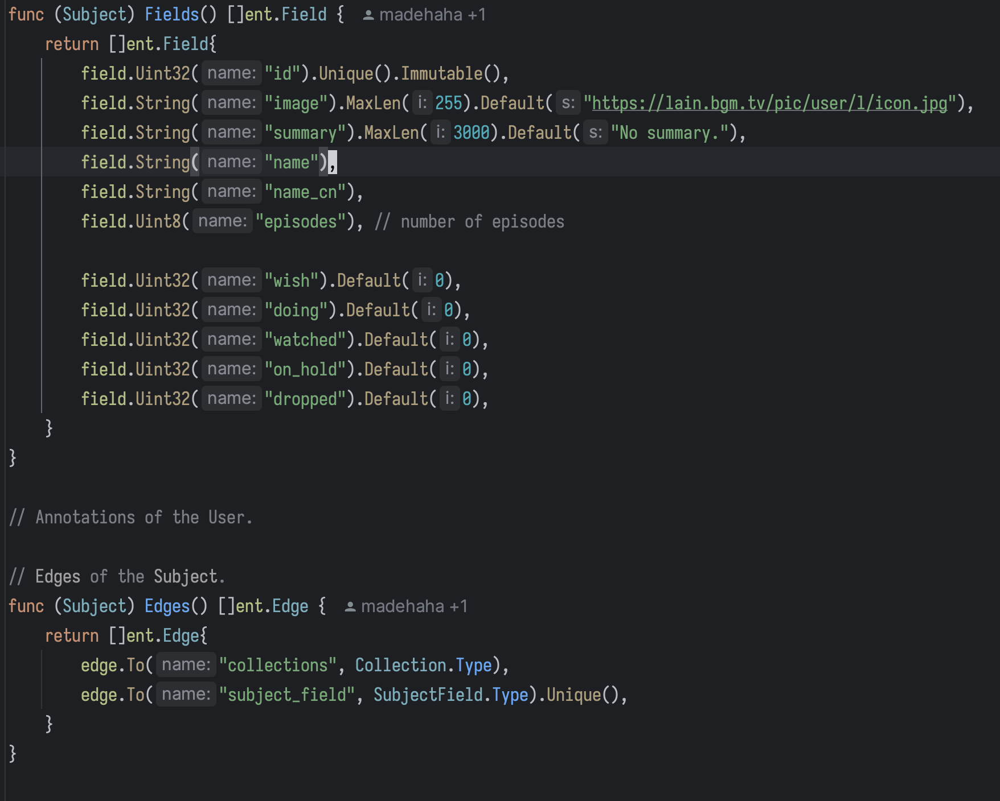

可以看到在subject表中，我们为它创建了两条edge，指向收藏（collections），以及subject_field，还可以指定edge的类型，是可以有多条还是unique的。

本项目是使用的jwt来进行用户鉴权，我们自己自定义了两个字段，用户id和用户组id。用户id很显然，是用来区分用户的。用户组id代表了用户的权限，当我们尝试创建条目的时候，我们就需要更高的用户权限。

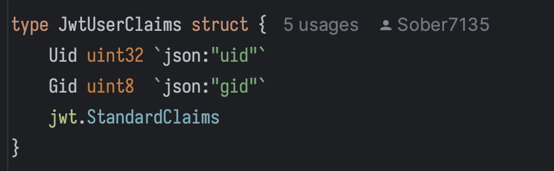

接下来介绍一下，web部分。

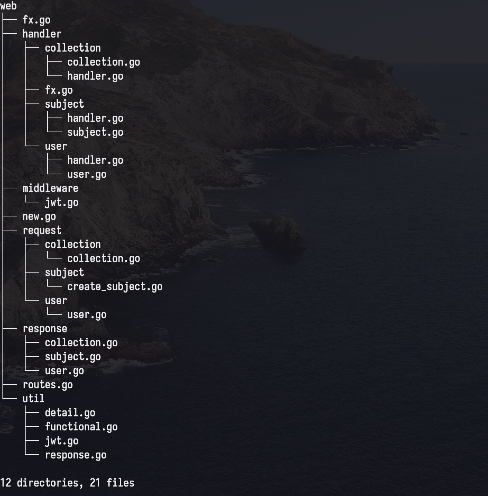

可以看到这里也有一个fx文件。new文件是对echo进行了一些简单了设置。可以看到我们使用了validate进行request body的参数验证，可以验证是否为必要的参数，还有简单的验证如数字的大小范围等。我们是直接将这个vailidator直接内嵌到了echo中。我们还设置了一个静态文件夹，用于储存一些文件。

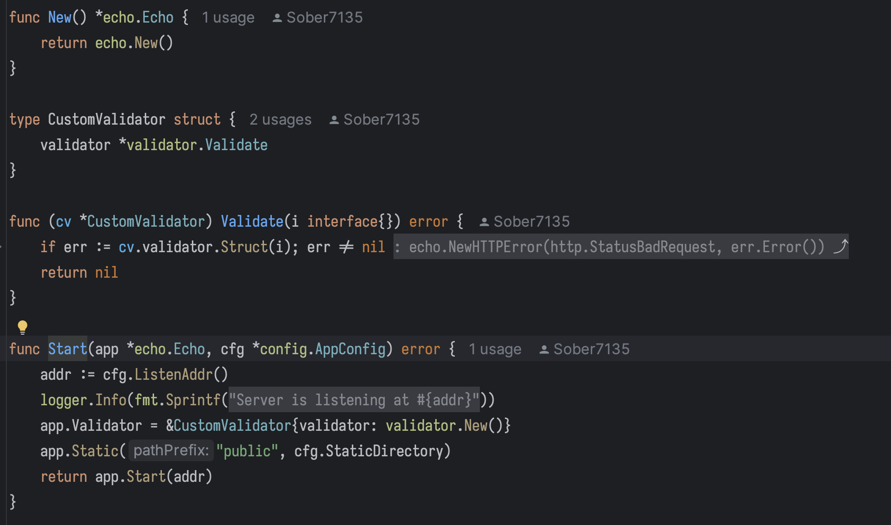

request和response就是一些结构体设置。

routes定义了本项目所有的路由，由于路由较多就不一一展示了。下面是部分截图

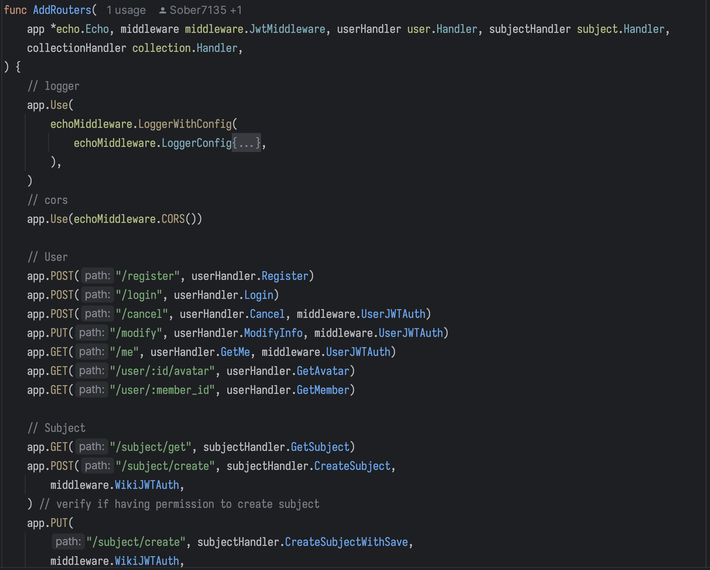

可以看到用到了三个中间件，CORS是echo内置的跨域中间件，UserJWTAuth和WikiJWTAuth都是jwt验证的中间件。UserJWTAuth就是简单的对用户进行鉴权，只要存在的用户就有权限进行访问。WikiJWTAuth对有subject编辑权限进行验证，对于没有权限的用户会直接返回401.

handler用来响应http request，在进行简单处理后，就转交给ctrl（在internal/ctrl中）进行处理。以user登陆为例。balabala

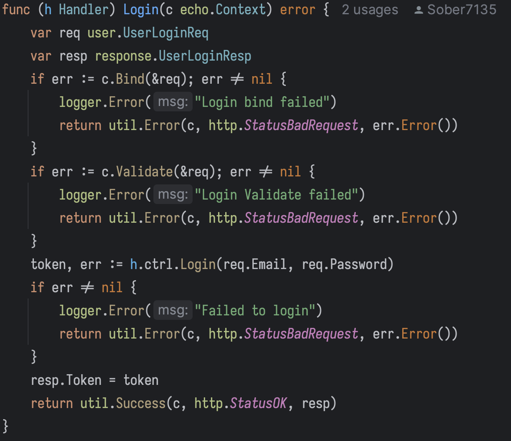

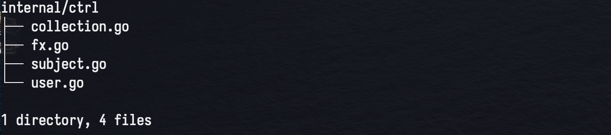

接下来介绍一下ctrl层，前面提到handler会调用这个层，这是处于handler和数据库层之间的中间层。以Login为例。

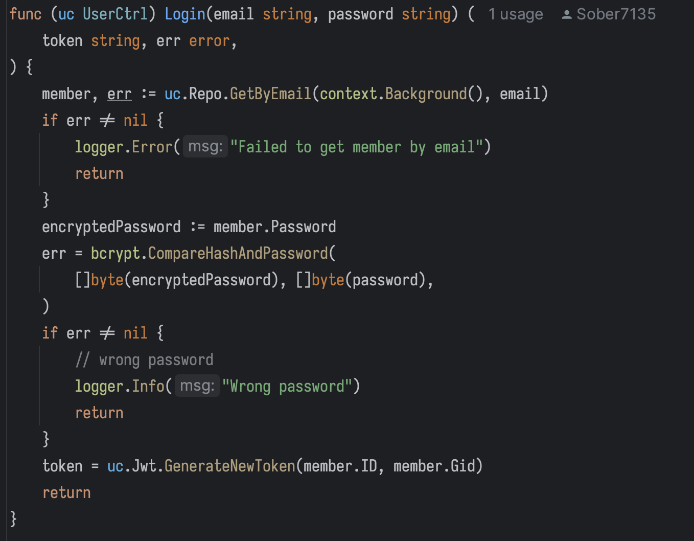

